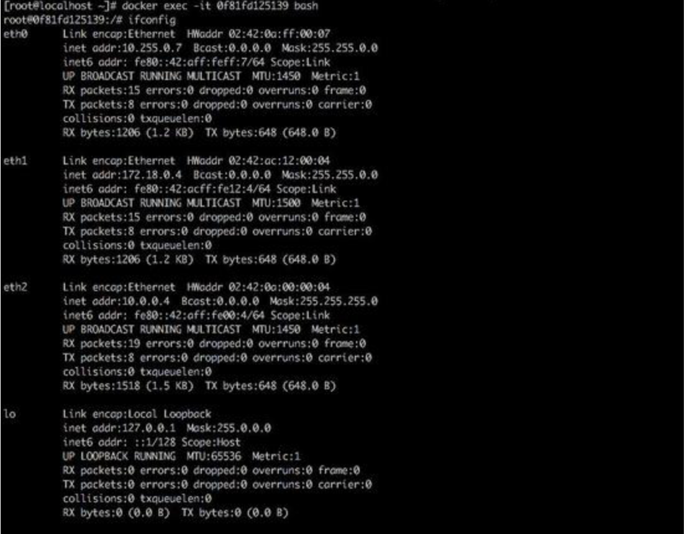
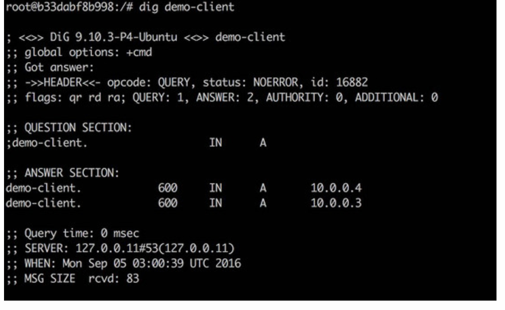
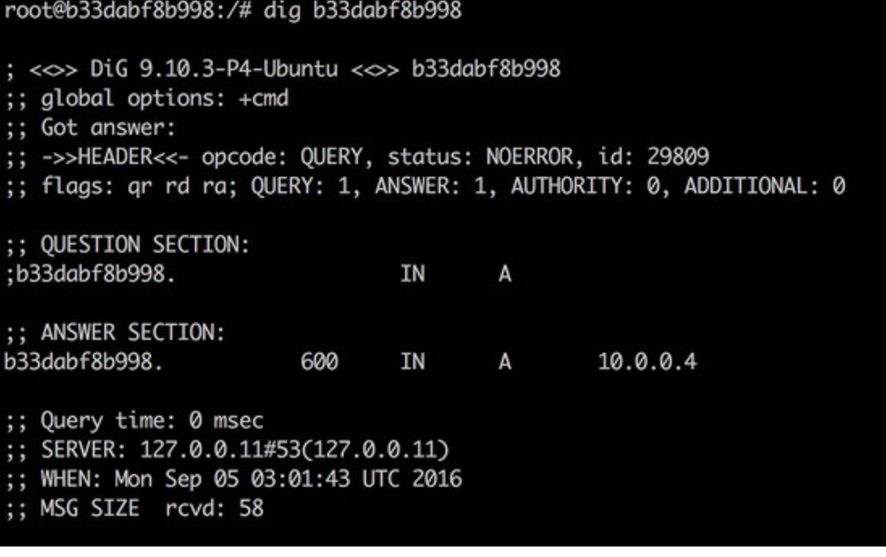
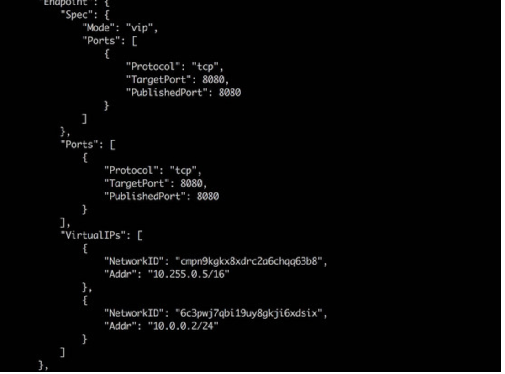

# Docker routing mesh

--

- 容器化之后大家发现以前的做法或多或少的需要做些调整。第一，由于主机概念被弱化，集群概念突出，应用程序不再依赖某个主机或者端口；第二，容器声明周期不固定，容器随时可能会被启动或者暂停，容器的数量可多可少。由于上面两个特性的引入，一些新的问题被引入，聪明的工程师们相到了一些办法来解决这些问题。第一个要解决的问题就是服务发现，针对的问题就是服务对外地址

   ### 不定和服务随时会被停止。
   服务发现之后要解决的就是如何把任务按照一定规则负载到容器中去，这就是第二个需要考虑出的问题。负载均衡解决了单一入口负载到多容器的上问题，但是由于容器调度之后会落在多个机器之上，假如某些主机上面没有工作的容器，而对外服务时候又希望可以被访问，**Routing mesh概念的引入是解决了多个入口点负载到单个容器的问题** 
   
### 服务发现

--

- 单纯的服务发现很好实现，无非就是检测container的启动，停止，根据这些变动记录下服务到底可以通过哪些IP+端口可以被访问，理论上比较容易实现。一个应用启动之后可能要准备环境，另外一个成熟的服务发现必备的条件是高可用，在docker 1.12版本之前是不具备高可用和状态一致性，这也是为什么需要引入raft协议。

### 负载均衡

--

- 传统的负载均衡根据协议不同可以分为7层和4层的，7层的负载均衡特点就是可以支持复杂的用户规则，比如HTTP header，cookie等应用逻辑，而四层只能支持4层的IP地址负载到不同的机器。

 Docker 1.12的服务发现和负载均衡结合到了一起，实现办法有两种，DNS 轮询和IPVS。理解这两种策略需要知道的一个前提是Docker为每一个服务分配了一个虚拟IP，这个IP 对应的不是一个具体的task或者一个container，而是专门为一个服务保留。
 
 
 ```
 docker service create -network overlay-test --name demo --replica=4 --emdpoint-mode=dnsrr ubuntu-base
 ```
使用了--endpoint-mode=dnsrr来做负载均衡,进入容器看一下网卡的情况



之前使用了overlay-test 网络，按道理说有两块网卡，实际上却生成了四块网卡

1 lo 网卡，本地回环网卡

2 eth2属于之前创建的overlay-test网络；

3 eth1和docker_gw bridge网络构成的网络可以使容器内的服务在主机上访问，主机上Telnet 8080 可以访问到我们的服务

4 eth0是ingress网络中的一块网卡，是为了routing mesh而设

继续回到容器查询一下服务情况，执行命令：




通过域名或者容器的ID都能查到IP地址，区别就是域名发现了本机上所有提供服务的的容器IP，至此同时实现了发现和内部负载均衡。

以上就是通过DNS轮训来实现服务的发现和负载均衡，这样的负载均衡有个缺点：

    1 一些应用可能缓存DNS请求，导致容器变化之后DNS不能实时更新
    2 DNS 生效时间也不能保证实时反应服务变化

来说明一下VIP和IPVS模式服务发现和负载均衡，。就是为docker每个服务分配一个VIP，DNS解析服务名称或者自定义的别名到这个VIP上。由于VIP 本身没有容器提供服务，Docker会把VIP 请求通过IPVS技术负载均衡到后面的容器

```
docker service create -network overlay-test --name demo -replica=4 --endpoint-mode=vip --publist 8080:8080 ubuntu-base
```
启动服务之后我们inspect一下


其中10.0.0.2就是overlay-test网络下面的endpoint，这个endpoint是非容器的

我们进入容器dig命令会发现：

```
#dig demo
demo 600 IN A 10.0.0.2

```
其中DNS解析出了一个虚拟地址，虚拟地址通过IPVS 和一系列的IPtables规则动态转发到容器，这样的负载均衡屏蔽了DNS轮询的实效性问题，

    


 
